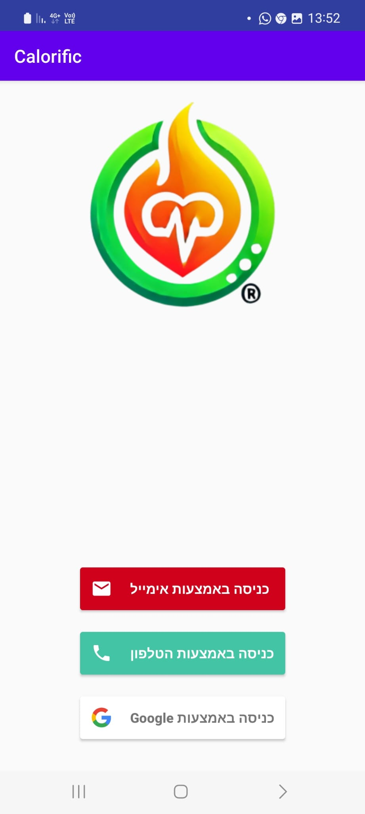
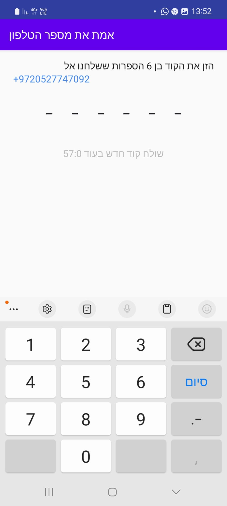
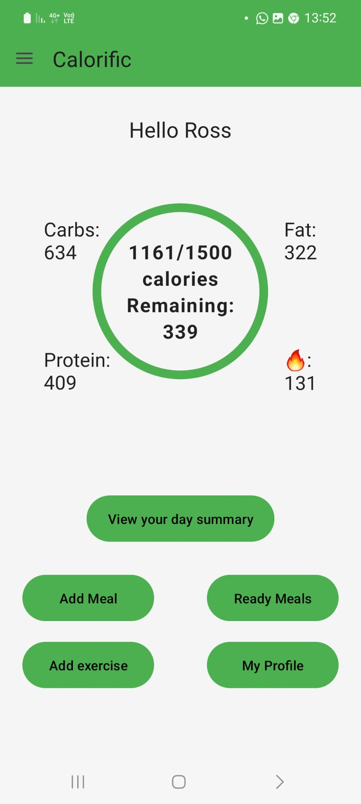
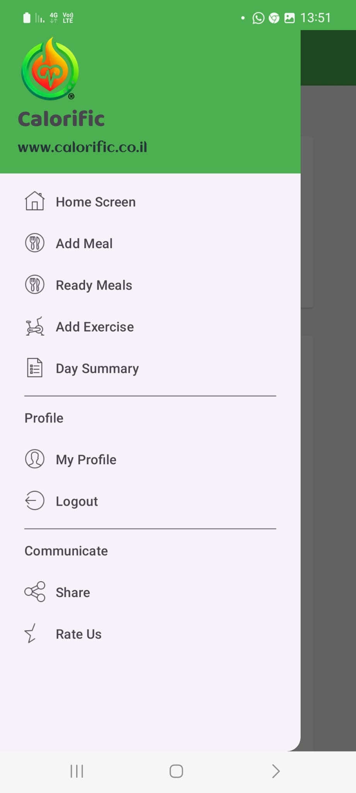
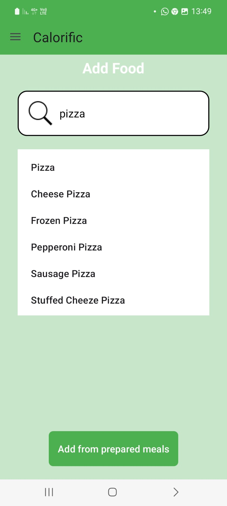
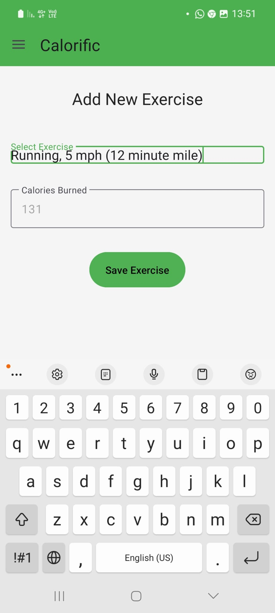
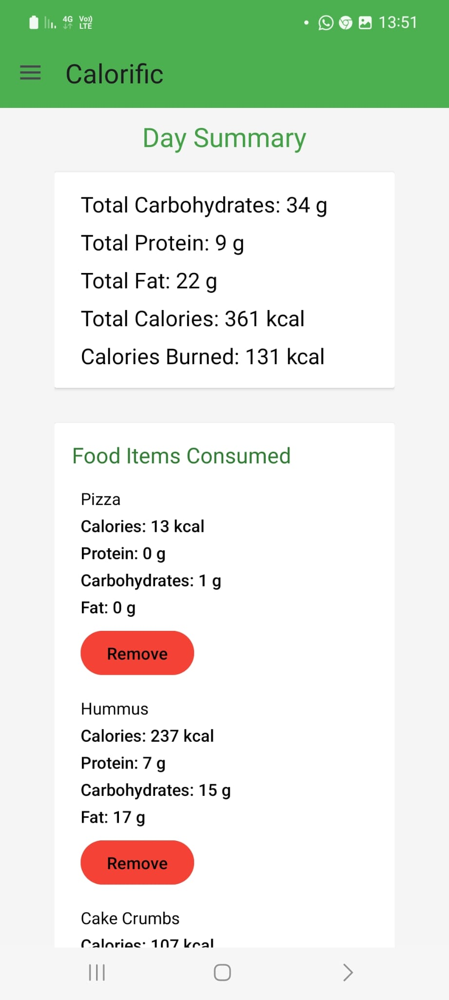
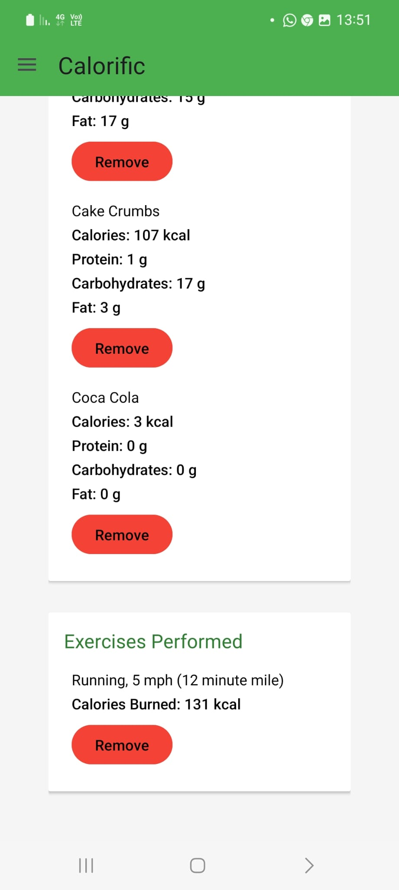

# Calorific

## Description
Calorific is designed to help individuals track their daily calorie intake and expenditure through a simple and user-friendly interface suitable for everyone.

## Features
- **User Registration and Login:** Register and log in using email, phone number, or Google account.
- **User Profile Management:** Fill in and update user details easily at any time.
- **Add Meal by Search:** Add meals from a database by searching.
- **Add Prepared Meal:** Add a prepared meal by entering its details (calories, grams of carbohydrates, protein, and fat).
- **Edit Prepared Meal:** Edit existing prepared meals.
- **Delete Prepared Meal:** Remove meals that are no longer needed.
- **Daily Summary:** View a summary of the day so far, including meals consumed, exercises performed, and their details.
- **Delete Meals and Exercises:** Remove meals or exercises if desired by the user.
- **Add Exercise from Database:** Add an exercise from a database that calculates calorie consumption based on the user's weight.
- **Daily Reset:** Reset all data at the end of the day to start fresh.

## Development
- **Firebase Authentication:** Used for user authentication during registration and login.
- **Firestore Database:** Manages storage of user data, including personal details, meals, and exercises.
- **Nutrition Information API:** Integrated a third-party API to retrieve detailed nutritional information about food items, enhancing the accuracy and ease of adding meals.

- **Activities:** Implemented to represent different screens of the application, managing user interactions and data display.
- **Data Models:** Created to encapsulate core entities such as users, meals, and exercises, ensuring organized data management.
  
- **Adapters:**
  - **ReadyMealAdapter:** Manages the list of user-prepared meals, allowing for easy editing or deletion.
  - **FoodApiAdapter:** Handles the integration and display of nutritional information retrieved from the external API.

## Screenshots

### 1. Registration and Login

### 2. Home Screen

### 3. Menu

### 4. Adding Meals

### 5. Adding Exercices

### 6. Daily Summary

